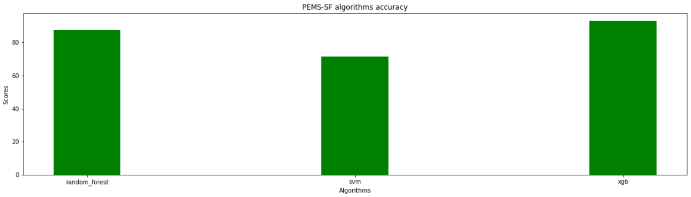
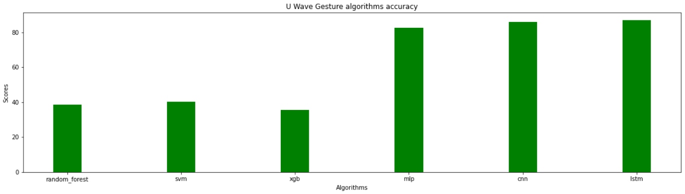

### Table of Contents

- **[Exploratory Data Analysis](#exploratory_data_analysis)**
  - **[Class Equilibrium](#class_equilibrium)**
  - **[U Wave Gesture axis evolution](#u_wave_gesture_axis_evolution)**
    - **[Random example for each gesture](#random_example_for_each_gesture)**
    - **[Axis evolution distribution per gesture](#axis_evolution_distribution_per_gesture)**
  - **[PEMS-SF Analysis](#pems-sf_analysis)**
    - **[Best sensors deviation week days](#best_sensors_deviation_week_days)**
    - **[Best sensors occupation rate year evolution](#best_sensors_occupation_rate_year_evolution)**
- **[Feature selection & classic algorithms](#feature_selection_and_classic_algorithms)**
  - **[PEMS-SF](#pems-sf)**
    - **[Random forest](#random_forest)**
    - **[SVM](#svm)**
    - **[Gradient Boosted Trees](#gradiend_boosted_trees)**
  - **[U Wave Gesture](#u_wave_gesture_classic)**
    - **[Random forest](#u_wave_gesture_classic_random_forest)**
    - **[SVM](#u_wave_gesture_classic_svm)**
    - **[Gradient Boosted Trees](#u_wave_gesture_classic_gradiend_boosted_trees)**
- **[Neural networks](#neural_networks)**
  - **[U Wave Gesture](#u_wave_gesture_nn)**
    - **[Multi-Layered Perceptron](#mlp)**
    - **[Convolutional Neural Network](#cnn)**
    - **[Long short-term memory](#lstm)**
- **[Final overview](#final_over_view)**
  - **[PEMS-SF](#pems-sf_final_overview)**
    - **[Accuracy](#pems-sf_final_overview_accuracy)**
    - **[Algorithms efficiency with respect to classes](#pems-sf_final_overview_algorithms)**
  - **[U Wave Gesture](#u_wave_gesture_final_overview)**
    - **[Accuracy](#u_wave_gesture_final_overview_accuracy)**
    - **[Algorithms efficiency with respect to classes](#u_wave_gesture_final_overview_algorithms)**

<a name="exploratory_data_analysis"></a>

## Exploratory Data Analysis

<a name="class_equilibrium"></a>

### Class Equilibrium


<br/>


<br/>


<br/>


<a name="u_wave_gesture_axis_evolution"></a>

### U Wave Gesture axis evolution

<a name="random_example_for_each_gesture"></a>

#### Random example for each gesture


<br/>


<br/>


<br/>


<br/>


<br/>


<br/>


<br/>


<a name="axis_evolution_distribution_per_gesture"></a>

#### Axis evolution distribution per gesture


<br/>


<br/>


<a name="pems-sf_analysis"></a>

### PEMS-SF Analysis

<a name="best_sensors_deviation_week_days"></a>

#### Best sensors deviation week days


<a name="best_sensors_occupation_rate_year_evolution"></a>

#### Best sensors occupation rate year evolution


<a name="feature_selection_and_classic_algorithms"></a>

## Feature selection & classic algorithms

<a name="pems-sf"></a>

### PEMS-SF

<a name="random_forest"></a>

#### Random forest

```
{
	"accuracy_score": 0.8959537572254336,
	"precision_score": [1.0, 1.0, 1.0, 0.82608696, 0.95,
		0.77419355, 0.76923077
	],
	"recall_score": [0.86666667, 1.0, 0.84615385, 0.82608696, 0.86363636,
		0.88888889, 1.0
	],
	"f1_score": [0.92857143, 1.0, 0.91666667, 0.82608696, 0.9047619,
		0.82758621, 0.86956522
	],
	"confusion_matrix": [
		[26, 0, 0, 0, 0, 0, 4],
		[0, 25, 0, 0, 0, 0, 0],
		[0, 0, 22, 4, 0, 0, 0],
		[0, 0, 0, 19, 0, 4, 0],
		[0, 0, 0, 0, 19, 3, 0],
		[0, 0, 0, 0, 1, 24, 2],
		[0, 0, 0, 0, 0, 0, 20]
	],
	"parameters": {
		"max_depth": 20,
		"min_samples_split": 2,
		"n_estimators": 200
	}
}
```

<a name="svm"></a>

#### SVM

```
{
	"accuracy_score": 0.7167630057803468,
	"precision_score": [0.82758621, 0.85714286, 0.66666667, 0.59090909, 0.7,{
	"accuracy_score": 0.930635838150289,
	"precision_score": [1.0, 0.88888889, 0.96, 1.0, 0.91666667,
		0.92592593, 0.83333333
	],
	"recall_score": [0.86666667, 0.96, 0.92307692, 0.86956522, 1.0,
		0.92592593, 1.0
	],
	"f1_score": [0.92857143, 0.92307692, 0.94117647, 0.93023256, 0.95652174,
		0.92592593, 0.90909091
	],
	"confusion_matrix": [
		[26, 0, 0, 0, 0, 2, 2],
		[0, 24, 1, 0, 0, 0, 0],
		[0, 0, 24, 0, 2, 0, 0],
		[0, 3, 0, 20, 0, 0, 0],
		[0, 0, 0, 0, 22, 0, 0],
		[0, 0, 0, 0, 0, 25, 2],
		[0, 0, 0, 0, 0, 0, 20]
	]
}
		0.6, 0.81818182
	],
	"recall_score": [0.8, 0.72, 0.61538462, 0.56521739, 0.63636364,
		0.77777778, 0.9
	],
	"f1_score": [0.81355932, 0.7826087, 0.64, 0.57777778, 0.66666667,
		0.67741935, 0.85714286
	],
	"confusion_matrix": [
		[24, 0, 0, 0, 0, 2, 4],
		[3, 18, 0, 2, 0, 2, 0],
		[0, 2, 16, 4, 2, 2, 0],
		[0, 0, 3, 13, 2, 5, 0],
		[0, 0, 2, 3, 14, 3, 0],
		[0, 1, 3, 0, 2, 21, 0],
		[2, 0, 0, 0, 0, 0, 18]
	],
	"parameters": {
		"C": 2,
		"degree": 2,
		"gamma": "scale",
		"kernel": "poly"
	}
}
```

<a name="gradiend_boosted_trees"></a>

#### Gradient Boosted Trees

```
{
	"accuracy_score": 0.930635838150289,
	"precision_score": [1.0, 0.88888889, 0.96, 1.0, 0.91666667,
		0.92592593, 0.83333333
	],
	"recall_score": [0.86666667, 0.96, 0.92307692, 0.86956522, 1.0,
		0.92592593, 1.0
	],
	"f1_score": [0.92857143, 0.92307692, 0.94117647, 0.93023256, 0.95652174,
		0.92592593, 0.90909091
	],
	"confusion_matrix": [
		[26, 0, 0, 0, 0, 2, 2],
		[0, 24, 1, 0, 0, 0, 0],
		[0, 0, 24, 0, 2, 0, 0],
		[0, 3, 0, 20, 0, 0, 0],
		[0, 0, 0, 0, 22, 0, 0],
		[0, 0, 0, 0, 0, 25, 2],
		[0, 0, 0, 0, 0, 0, 20]
	],
	"parameters": {
		"learning_rate": 0.1,
		"max_depth": 2,
		"n_estimators": 100
	}
}
```

<a name="u_wave_gesture_classic"></a>

### U Wave Gesture

<a name="u_wave_gesture_classic_random_forest"></a>

#### Random forest

```
{
	"accuracy_score": 0.375,
	"precision_score": [0.30666667, 0.58695652, 0.36956522, 0.11111111, 0.41666667,
		0.35897436, 0.375, 0.375
	],
	"recall_score": [0.575, 0.675, 0.425, 0.05, 0.25, 0.35, 0.375, 0.3],
	"f1_score": [0.4, 0.62790698, 0.39534884, 0.06896552, 0.3125,
		0.35443038, 0.375, 0.33333333
	],
	"confusion_matrix": [
		[23, 1, 2, 6, 0, 2, 3, 3],
		[2, 27, 0, 0, 0, 0, 7, 4],
		[9, 0, 17, 5, 5, 4, 0, 0],
		[7, 0, 17, 2, 4, 7, 0, 3],
		[10, 1, 5, 0, 10, 12, 1, 1],
		[10, 0, 5, 5, 5, 14, 0, 1],
		[9, 8, 0, 0, 0, 0, 15, 8],
		[5, 9, 0, 0, 0, 0, 14, 12]
	],
	"parameters": {
		"max_depth": 15,
		"min_samples_split": 7,
		"n_estimators": 200
	}
}
```

<a name="u_wave_gesture_classic_svm"></a>

#### SVM

```
{
	"accuracy_score": 0.403125,
	"precision_score": [0.29487179, 0.60465116, 0.5, 0.3125, 0.43478261,
		0.39473684, 0.39285714, 0.39583333
	],
	"recall_score": [0.575, 0.65, 0.375, 0.25, 0.25, 0.375, 0.275, 0.475],
	"f1_score": [0.38983051, 0.62650602, 0.42857143, 0.27777778, 0.31746032,
		0.38461538, 0.32352941, 0.43181818
	],
	"confusion_matrix": [
		[23, 0, 0, 6, 0, 3, 3, 5],
		[4, 26, 0, 0, 0, 0, 5, 5],
		[6, 1, 15, 12, 2, 4, 0, 0],
		[8, 0, 11, 10, 4, 4, 0, 3],
		[10, 3, 2, 0, 10, 12, 1, 2],
		[11, 0, 2, 4, 7, 15, 0, 1],
		[11, 5, 0, 0, 0, 0, 11, 13],
		[5, 8, 0, 0, 0, 0, 8, 19]
	],
	"parameters": {
		"C": 4,
		"degree": 1,
		"gamma": "scale",
		"kernel": "poly"
	}
}
```

<a name="u_wave_gesture_classic_gradiend_boosted_trees"></a>

#### Gradient Boosted Trees

```
{
	"accuracy_score": 0.35625,
	"precision_score": [0.3442623, 0.55813953, 0.31111111, 0.28571429, 0.33333333,
		0.32692308, 0.32258065, 0.31818182
	],
	"recall_score": [0.525, 0.6, 0.35, 0.1, 0.25, 0.425, 0.25, 0.35],
	"f1_score": [0.41584158, 0.57831325, 0.32941176, 0.14814815, 0.28571429,
		0.36956522, 0.28169014, 0.33333333
	],
	"confusion_matrix": [
		[21, 1, 3, 2, 3, 3, 3, 4],
		[5, 24, 0, 0, 0, 0, 4, 7],
		[6, 1, 14, 8, 2, 8, 1, 0],
		[4, 0, 14, 4, 5, 9, 0, 4],
		[6, 1, 6, 0, 10, 15, 1, 1],
		[7, 0, 8, 0, 7, 17, 0, 1],
		[6, 10, 0, 0, 1, 0, 10, 13],
		[6, 6, 0, 0, 2, 0, 12, 14]
	],
	"parameters": {
		"learning_rate": 0.05,
		"max_depth": 4,
		"n_estimators": 5
	}
}
```

<a name="neural_networks"></a>

## Neural networks

<a name="u_wave_gesture_nn"></a>

### U Wave Gesture

<a name="mlp"></a>

#### Multi-Layered Perceptron

```
{
	"accuracy_score": 0.853125,
	"precision_score": [0.9, 0.90697674, 0.85714286, 0.9, 0.68627451,
		0.75, 1.0, 0.925
	],
	"recall_score": [0.9, 0.975, 0.9, 0.675, 0.875, 0.825, 0.75, 0.925],
	"f1_score": [0.9, 0.93975904, 0.87804878, 0.77142857, 0.76923077,
		0.78571429, 0.85714286, 0.925
	],
	"confusion_matrix": [
		[36, 0, 0, 0, 0, 4, 0, 0],
		[0, 39, 0, 0, 0, 1, 0, 0],
		[0, 0, 36, 1, 3, 0, 0, 0],
		[0, 0, 0, 27, 12, 0, 0, 1],
		[0, 1, 1, 0, 35, 3, 0, 0],
		[4, 0, 1, 2, 0, 33, 0, 0],
		[0, 3, 4, 0, 0, 1, 30, 2],
		[0, 0, 0, 0, 1, 2, 0, 37]
	],
	"parameters": {
		"activation": "relu",
		"solver": "adam",
		"alpha": 0.001,
		"learning_rate": "constant",
		"hidden_layer_sizes": (100, 100, 100, 100, 100),
		"max_iter": 100000
	}
}
```

<a name="cnn"></a>

#### Convolutional Neural Network

```
{
	"accuracy_score": 0.859375,
	"precision_score": [0.94594595, 0.86666667, 0.8372093, 0.86666667, 0.74,
		0.85365854, 0.88235294, 0.925
	],
	"recall_score": [0.875, 0.975, 0.9, 0.65, 0.925, 0.875, 0.75, 0.925],
	"f1_score": [0.90909091, 0.91764706, 0.86746988, 0.74285714, 0.82222222,
		0.86419753, 0.81081081, 0.925
	],
	"confusion_matrix": [
		[35, 0, 1, 0, 0, 4, 0, 0],
		[0, 39, 0, 0, 0, 1, 0, 0],
		[0, 0, 36, 1, 1, 0, 2, 0],
		[0, 0, 0, 26, 11, 1, 0, 2],
		[0, 1, 1, 0, 37, 0, 1, 0],
		[0, 0, 2, 2, 0, 35, 1, 0],
		[0, 5, 3, 1, 0, 0, 30, 1],
		[2, 0, 0, 0, 1, 0, 0, 37]
	]
}
```

<a name="lstm"></a>

#### Long short-term memory

```
{
	"accuracy_score": 0.86875,
	"precision_score": [0.92307692, 0.95238095, 0.85365854, 0.92307692, 0.65454545,
		0.80487805, 1.0, 0.95121951
	],
	"recall_score": [0.9, 1.0, 0.875, 0.6, 0.9, 0.825, 0.875, 0.975],
	"f1_score": [0.91139241, 0.97560976, 0.86419753, 0.72727273, 0.75789474,
		0.81481481, 0.93333333, 0.96296296
	],
	"confusion_matrix": [
		[36, 0, 1, 0, 0, 3, 0, 0],
		[0, 40, 0, 0, 0, 0, 0, 0],
		[0, 0, 35, 0, 4, 1, 0, 0],
		[0, 0, 0, 24, 14, 1, 0, 1],
		[0, 0, 1, 0, 36, 2, 0, 1],
		[3, 0, 1, 2, 1, 33, 0, 0],
		[0, 2, 3, 0, 0, 0, 35, 0],
		[0, 0, 0, 0, 0, 1, 0, 39]
	]
}
```

<a name="final_over_view"></a>

## Final overview

<a name="pems-sf_final_overview"></a>

### PEMS-SF

<a name="pems-sf_final_overview_accuracy"></a>

#### Accuracy



<a name="pems-sf_final_overview_algorithms"></a>

#### Algorithms efficiency with respect to classes

<a name="u_wave_gesture_final_overview"></a>


<br/>


<br/>


<br/>

### U Wave Gesture

<a name="u_wave_gesture_final_overview_accuracy"></a>

#### Accuracy



<a name="u_wave_gesture_final_overview_algorithms"></a>

#### Algorithms efficiency with respect to classes


<br/>


<br/>


<br/>


<br/>


<br/>


<hr/>
