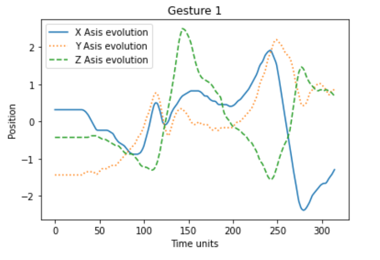

### Table of Contents

- **[Exploratory Data Analysis](#exploratory_data_analysis)**
  - **[Class Equilibrium](#class_equilibrium)**
  - **[U Wave Gesture axis evolution](#u_wave_gesture_axis_evolution)**
    - **[Random example for each gesture](#random_example_for_each_gesture)**
    - **[Axis evolution distribution per gesture](#axis_evolution_distribution_per_gesture)**
  - **[PEMS-SF Analysis](#pems-sf_analysis)**
    - **[Best sensors deviation week days](#best_sensors_deviation_week_days)**
    - **[Best sensors occupation rate year evolution](#best_sensors_occupation_rate_year_evolution)**
- **[Feature selection & classic algorithms](#feature_selection_and_classic_algorithms)**
  - **[PEMS-SF](#pems-sf)**
    - **[Random forest](#random_forest)**
    - **[SVM](#svm)**
    - **[Gradient Boosted Trees](#gradiend_boosted_trees)**

<a name="exploratory_data_analysis"></a>

## Exploratory Data Analysis

<a name="class_equilibrium"></a>

### Class Equilibrium


<a name="u_wave_gesture_axis_evolution"></a>

### U Wave Gesture axis evolution

<a name="random_example_for_each_gesture"></a>

#### Random example for each gesture




<a name="axis_evolution_distribution_per_gesture"></a>

#### Axis evolution distribution per gesture


<a name="pems-sf_analysis"></a>

### PEMS-SF Analysis

<a name="best_sensors_deviation_week_days"></a>

#### Best sensors deviation week days


<a name="best_sensors_occupation_rate_year_evolution"></a>

#### Best sensors occupation rate year evolution


<a name="feature_selection_and_classic_algorithms"></a>

## Feature selection & classic algorithms

<a name="pems-sf"></a>

### PEMS-SF

<a name="random_forest"></a>

#### Random forest

```
{
	"accuracy_score": 0.8670520231213873,
	"precision_score": [1.0, 0.92592593, 0.95, 0.7826087, 0.94736842,
		0.75, 0.76923077
	],
	"recall_score": [0.86666667, 1.0, 0.73076923, 0.7826087, 0.81818182,
		0.88888889, 1.0
	],
	"f1_score": [0.92857143, 0.96153846, 0.82608696, 0.7826087, 0.87804878,
		0.81355932, 0.86956522
	],
	"confusion_matrix": [
		[26, 0, 0, 0, 0, 0, 4],
		[0, 25, 0, 0, 0, 0, 0],
		[0, 2, 19, 5, 0, 0, 0],
		[0, 0, 1, 18, 0, 4, 0],
		[0, 0, 0, 0, 18, 4, 0],
		[0, 0, 0, 0, 1, 24, 2],
		[0, 0, 0, 0, 0, 0, 20]
	]
}
```

<a name="svm"></a>

#### SVM

```
{
	"accuracy_score": 0.7167630057803468,
	"precision_score": [0.82758621, 0.85714286, 0.66666667, 0.59090909, 0.7,
		0.6, 0.81818182
	],
	"recall_score": [0.8, 0.72, 0.61538462, 0.56521739, 0.63636364,
		0.77777778, 0.9
	],
	"f1_score": [0.81355932, 0.7826087, 0.64, 0.57777778, 0.66666667,
		0.67741935, 0.85714286
	],
	"confusion_matrix": [
		[24, 0, 0, 0, 0, 2, 4],
		[3, 18, 0, 2, 0, 2, 0],
		[0, 2, 16, 4, 2, 2, 0],
		[0, 0, 3, 13, 2, 5, 0],
		[0, 0, 2, 3, 14, 3, 0],
		[0, 1, 3, 0, 2, 21, 0],
		[2, 0, 0, 0, 0, 0, 18]
	]
}
```

<a name="gradiend_boosted_trees"></a>

#### Gradient Boosted Trees

```
{
	"accuracy_score": 0.930635838150289,
	"precision_score": [1.0, 0.88888889, 0.96, 1.0, 0.91666667,
		0.92592593, 0.83333333
	],
	"recall_score": [0.86666667, 0.96, 0.92307692, 0.86956522, 1.0,
		0.92592593, 1.0
	],
	"f1_score": [0.92857143, 0.92307692, 0.94117647, 0.93023256, 0.95652174,
		0.92592593, 0.90909091
	],
	"confusion_matrix": [
		[26, 0, 0, 0, 0, 2, 2],
		[0, 24, 1, 0, 0, 0, 0],
		[0, 0, 24, 0, 2, 0, 0],
		[0, 3, 0, 20, 0, 0, 0],
		[0, 0, 0, 0, 22, 0, 0],
		[0, 0, 0, 0, 0, 25, 2],
		[0, 0, 0, 0, 0, 0, 20]
	]
}
```
